# Oral Lesion Classification & Segmentation using Deep Learning

  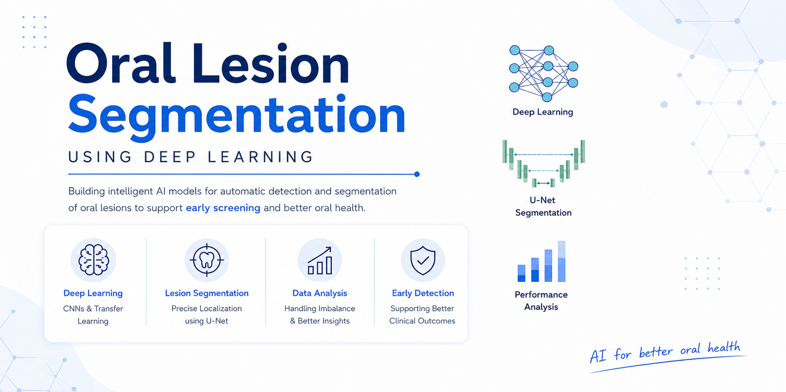

---

## Overview

This project focuses on Automated Oral Lesion Classification and Segmentation using Deep Learning Techniques. The main goal was to explore whether Deep Learning models can help in identifying oral diseases from patient mouth images, especially Oral Potentially Malignant Disorders (OPMD) and Oral Cancer (OCA). During this project, I explored multiple approaches starting from traditional machine learning models on tabular data and gradually moved towards CNN-based image models, hybrid architectures, and finally segmentation models using U-Net.

This project was mainly focused on:

- Handling severe class imbalance
- Learning from limited medical data
- Improving minority class detection
- Exploring medical image segmentation techniques

---

## Problem Statement

Oral cancer is often diagnosed at later stages, which makes treatment difficult. One of the major challenges in medical imaging datasets is class imbalance. In this dataset, healthy and common disease samples were much larger in number compared to Oral Cancer (OCA) samples.

Because of this, models easily become biased toward majority classes and fail to properly identify rare but important disease categories. The objective of this project was to explore different Deep Learning approaches to improve classification and segmentation performance on such challenging medical data.

The objective was to classify:
- Healthy
- Benign
- OPMD
- OCA

---

## Project Pipeline

  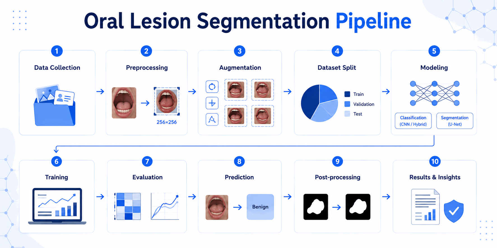

---

## Data Preprocessing

Several preprocessing techniques were applied before training:

- Mouth region extraction using annotation coordinates
- Image resizing to 256×256
- Data Augmentation
- Prevention of data leakage during splitting

Instead of using the full raw image, the model was trained only on the cropped mouth region to remove unnecessary background information.

---

# Models Explored

## 1. Tabular Machine Learning Models

I initially started with patient metadata and habit-based features such as smoking, alcohol consumption, chewing betel quid, and age using:

- Neural Networks
- XGBoost

The goal was to check whether patient habits and demographic information alone could help classify

Because of severe class imbalance, the models became biased toward majority classes and struggled on minority classes like OCA.

### Initial Results

| Model | Accuracy | Weighted F1 |
|---|---|---|
| Neural Network | 51% | 0.48 |
| XGBoost | 56% | 0.51 |

  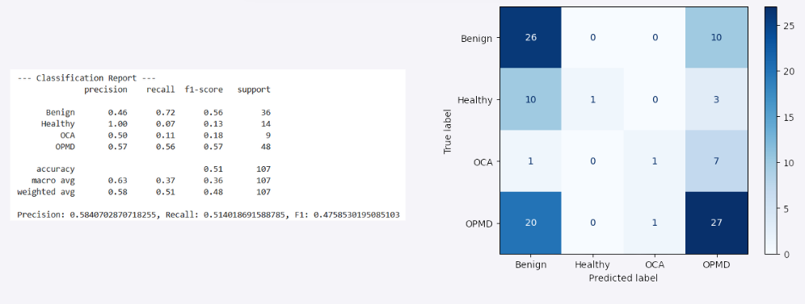
  &nbsp;
  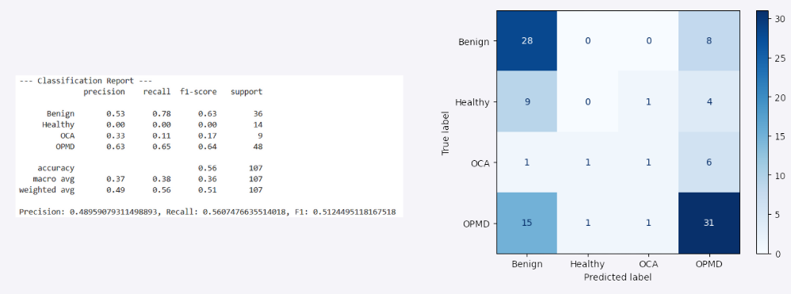

---

### Applying SMOTE

To improve minority class prediction, I applied **SMOTE (Synthetic Minority Oversampling Technique)** for balancing the dataset.

### Results After SMOTE

| Model | Accuracy | Weighted F1 |
|---|---|---|
| Neural Network + SMOTE | 42% | 0.42 |
| XGBoost + SMOTE | 47% | 0.47 |

  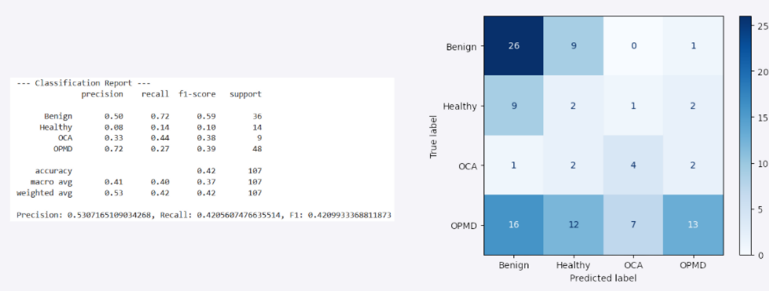
  &nbsp;
  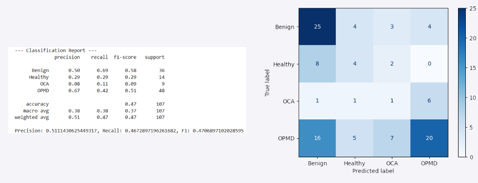

Even after SMOTE, tabular models alone were not sufficient for reliable classification, which motivated the shift toward CNN-based image models.

---

## 2. CNN-Based Image Models

After limited performance from tabular models, I shifted toward image-based Deep Learning approaches where the model could directly learn visual patterns from oral cavity images.

---

### Image Preprocessing & Training Pipeline

Instead of using full raw images, I extracted the mouth region using annotation coordinates to remove unnecessary background information and focus only on the relevant region of interest.

Preprocessing steps included:
- Mouth ROI extraction using annotation data
- Image resizing to 256×256
- Random flips, rotations, and zoom augmentations
- Class weights for imbalance handling
- Prevention of data leakage during splitting

  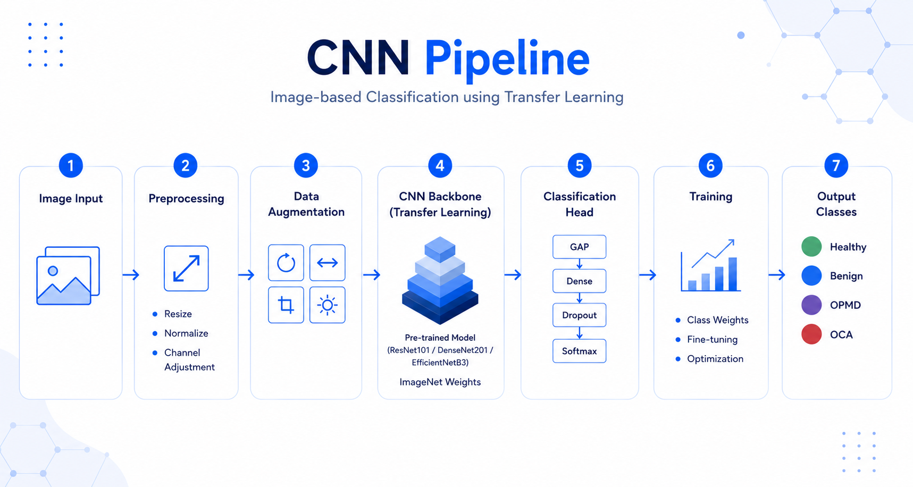

---

### CNN Architectures Explored

The following pre-trained architectures were explored using Transfer Learning:
- ResNet101
- DenseNet201
- EfficientNetB3

Rather than training from scratch, ImageNet pre-trained weights were used and later fine-tuned on oral lesion images.

---

### Initial CNN Results

The first training runs performed significantly better than tabular models, but the models still showed bias toward majority classes and struggled on minority classes like OCA.

| Model | Accuracy |
|---|---|
| ResNet101 | 56.72% |
| DenseNet201 | 53.05% |
| EfficientNetB3 | 48.17% |

  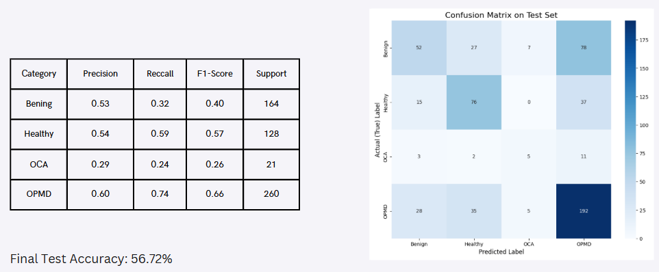
  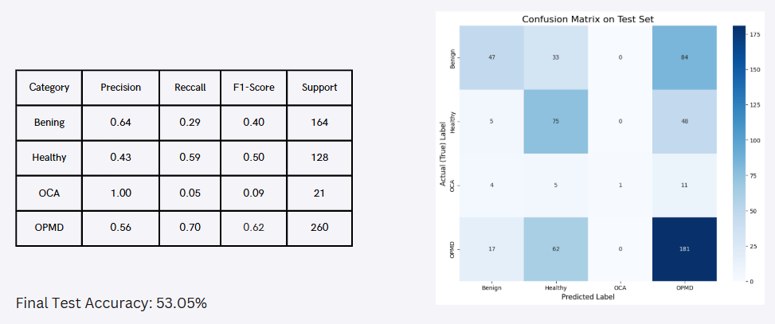
  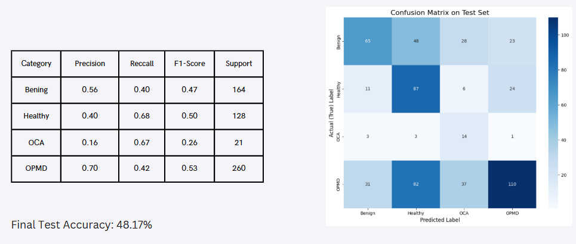

---

### Improving Minority Class Detection

To improve minority class prediction, especially for Oral Cancer samples, I implemented:
- Class Weights
- Two-Phase Fine-Tuning

#### Fine-Tuning Strategy
- Phase 1: Train only custom classifier layers
- Phase 2: Unfreeze top layers and continue training with a very low learning rate

This helped the models adapt better to oral medical images while preserving useful pre-trained ImageNet features.

---

### Performance After Fine-Tuning

The updated models showed noticeable improvement in recall and F1-score for minority classes.

| Model | Accuracy |
|---|---|
| ResNet101 | 59.69% |
| DenseNet201 | 59.69% |
| EfficientNetB3 | 59.51% |

  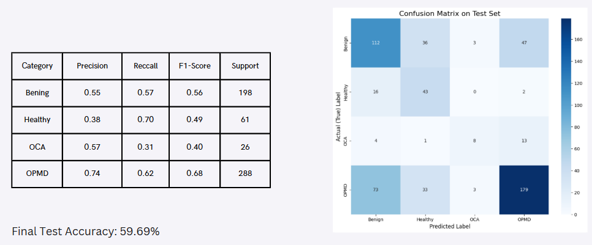
  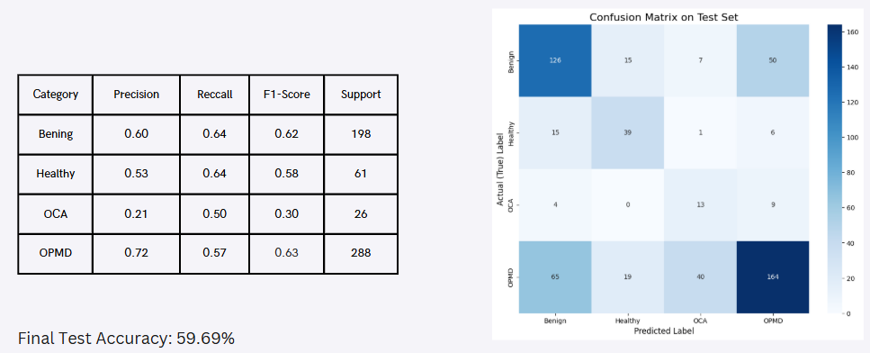
  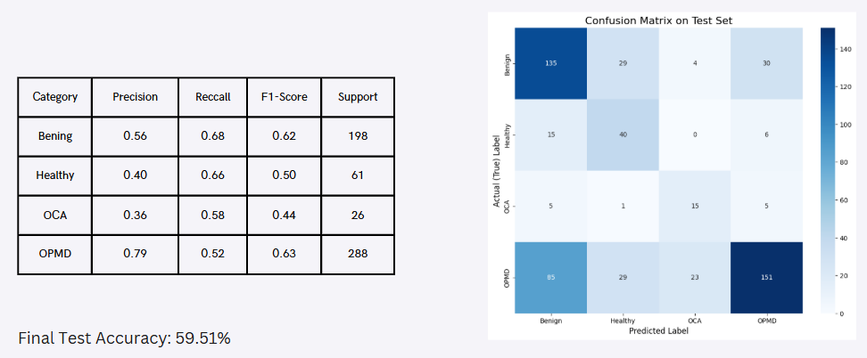

---

### Training Behaviour

The training curves clearly showed the impact of fine-tuning and class weighting on validation performance and convergence stability.

  

The CNN-based approach significantly outperformed earlier tabular models and provided much better feature learning from medical images.

---

## 3. Hybrid Deep Learning Model

After experimenting with standalone CNN models, I explored a Hybrid Deep Learning approach by combining:
- CNN image features
- Important tabular metadata features

The motivation behind this approach was to combine:
- visual lesion patterns from oral images
- patient-level metadata such as habits and demographic information

The hybrid model used:
- CNN backbone for image feature extraction
- Dense layers for metadata processing
- Feature concatenation before final classification

This approach attempted to improve prediction consistency across minority classes while preserving strong image feature learning.

---

### Hybrid Model Results

The Hybrid Model achieved slightly better and more balanced performance compared to standalone CNN architectures.

| Model | Accuracy |
|---|---|
| Hybrid ResNet101 | 59.69% |
| Hybrid DenseNet201 | 59.69% |
| Hybrid EfficientNetB3 | 59.51% |

  
  
  

The hybrid approach improved overall balance between classes, although minority class prediction still remained challenging because of dataset imbalance and limited samples for OCA.

---

## 4. U-Net Segmentation

Finally, I experimented with semantic segmentation using U-Net to directly localize lesion regions inside oral cavity images. Unlike classification models, segmentation predicts pixel-level masks instead of a single disease label. The main objective was to identify lesion regions directly from oral images using annotation masks.

---

### Segmentation Pipeline

The segmentation experiments included:
- U-Net based architecture
- Dice Loss
- Focal Loss
- Data Augmentation
- Class Weights

The model was trained on lesion masks generated from annotation data.

---

### Initial U-Net Results

The initial segmentation model struggled heavily with minority lesion regions and became biased toward dominant background regions.

  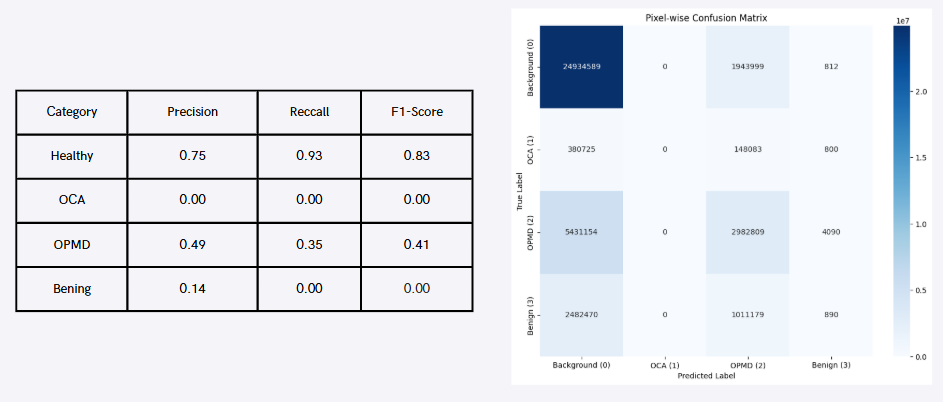

This showed that pixel-level imbalance was an even bigger challenge than classification imbalance.

---

### Applying Class Weights

To improve lesion localization, class weights were introduced during training to penalize mistakes on underrepresented lesion pixels.

This improved segmentation quality for lesion regions, especially for OPMD areas.

  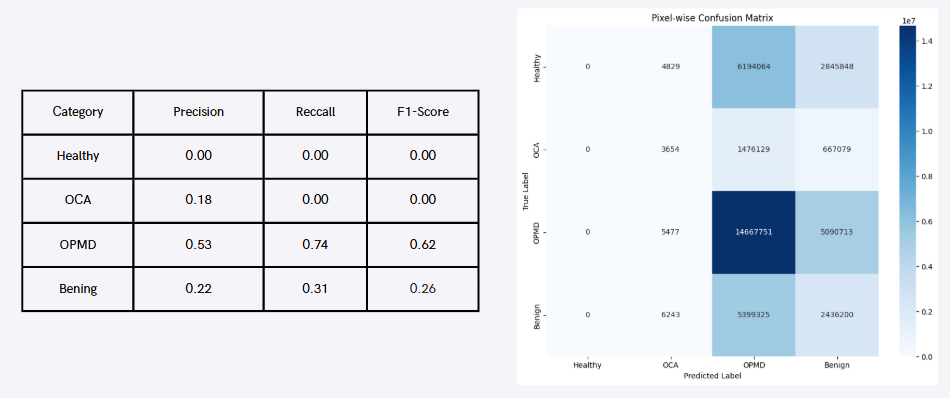

---

### Multi-Stage Segmentation Experiments

I also experimented with a multi-stage segmentation pipeline:

#### Stage 1
Binary lesion localization:
- Background
- Lesion

  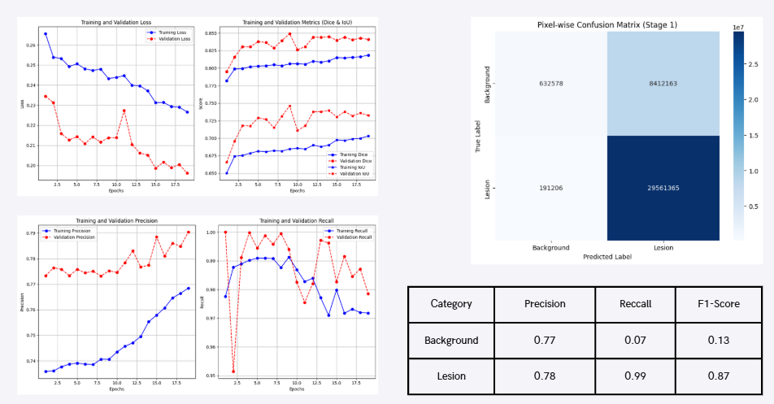

The first stage achieved strong lesion recall but still struggled with background precision because of highly imbalanced pixel distributions.

---

#### Stage 2
Lesion category classification on cropped lesion regions:
- OCA
- OPMD
- Benign

  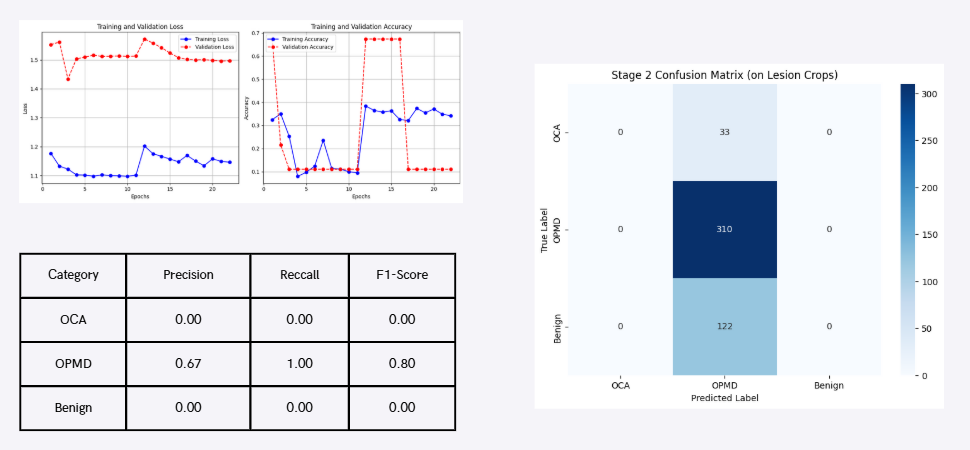

The second stage remained difficult because of limited lesion-specific training samples and overlapping visual characteristics between classes.

---

### Key Observation

The segmentation experiments showed that lesion localization is significantly more challenging than image classification because of:
- limited annotated data
- severe class imbalance
- noisy medical images
- highly irregular lesion boundaries

Even though segmentation performance was limited, these experiments provided valuable insights into:
- medical image segmentation workflows
- imbalance handling techniques
- multi-stage lesion analysis pipelines

---

## Overall Results Summary

| Approach | Best Accuracy |
|---|---|
| Tabular Models | 56% |
| CNN Models | 59.69% |
| Hybrid Models | 59.69% |
| U-Net Segmentation | Experimental |

The project showed that image-based Deep Learning approaches significantly outperform tabular-only models for oral lesion analysis.

---

## Research Challenges

Some major challenges during this project included:
- Severe class imbalance
- Limited annotated medical data
- High visual similarity between lesion categories
- Noisy clinical images
- Difficulty in minority class generalization

---

## Future Improvements

Some possible future improvements:

- Attention U-Net
- Vision Transformers
- Better lesion annotations
- Larger balanced datasets
- Self-supervised learning
- Multi-modal architectures
- Web deployment for screening assistance

---

---

## Disclaimer

This project is intended for research and educational purposes only and should not be used for clinical diagnosis.

---

## Note

The dataset used in this project is not included because it belongs to its respective owners.

---

## Author
Kunal Gandvane\
Student at Department of Civil Engineering\
Indian Institute of Technology Bombay

## Contact
For any inquiries or further information, please contact me at [LinkedIn.](https://www.linkedin.com/in/kunal-gandvane-b28062346/)
